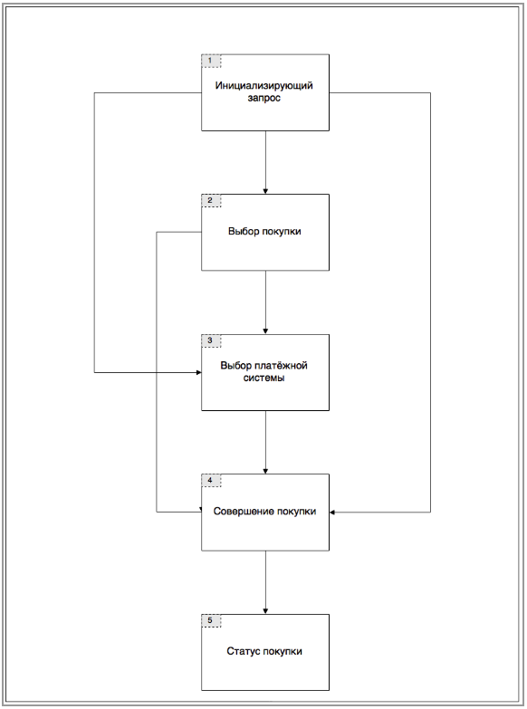
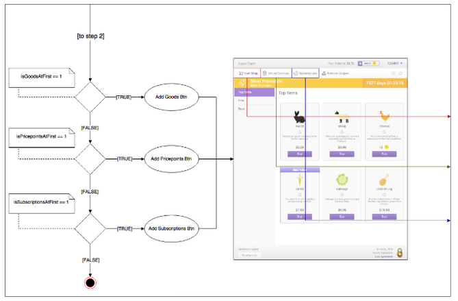
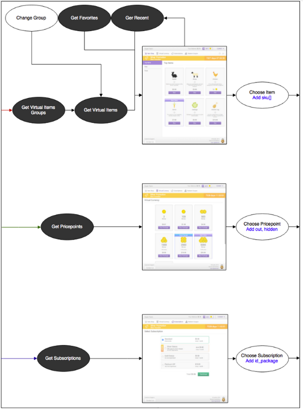
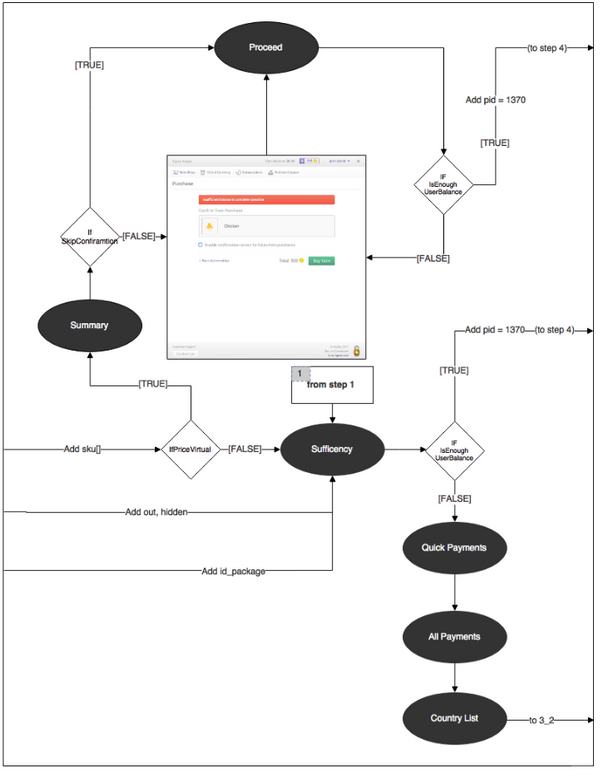

Описание библиотеки, реализующей функции магазина на основе [Pay Station API](https://developers.xsolla.com/api/v2/pay-station/).

 * [1. Общие сведения](#1-общие-сведения)
 * [2. Термины и определения](#2-термины-и-определения)
 * [3. Использование библиотеки](#3-функциональное-назначение)
   * [3.1. Упрощенная интеграция](#31-упрощенная-интеграция)
 * [4. Общая схема работы](#4-общая-схема-работы)
   * [4.1. Инициализирующий запрос](#41-инициализирующий-запрос)
   * [4.2. Выбор покупки](#42-выбор-покупки)
   * [4.3. Выбор платежной системы](#43-выбор-платежной-системы)
     * [4.3.1. Покупка за реальную валюту](#431-покупка-за-реальную-валюту)
     * [4.3.2. Покупка за виртуальную валюту](#432-покупка-за-виртуальную-валюту)


# 1. Общие сведения

Библиотека имеет следующие преимущества:

* облегчает использование платежного решения Xsolla и снижает порог входа для разработчиков различных платформ;
* снижает трудозатраты разработчика по вредрению платежного решения Xsolla;
* улучшает user experience конечного пользователя: меньше дополнительных переходов на сторонние окна.

Используя всего одну функцию, разработчик получает полный набор функций электронного магазина с модулями виртуальной валюты, виртуальных товаров, подписок и поддержкой платежных методов. 

Посредством взаимодействия с [Pay Station API](https://developers.xsolla.com/api/v2/pay-station/) реализуется отрисовка магазина со всеми внутренними взаимодействиями, включающая в себя следующие экраны: 

* экран виртуальных товаров; 
* экран виртуальной валюты; 
* экран подписок;
* экран выбора платежных методов; 
* экран оплаты; 
* экран статуса; 
* экран ошибки.

# 2. Термины и определения

* **Токен** - специальная шифрованная строка, необходимая для взаимодействия с Xsolla.
* **Серверная интеграция** - интеграция и взаимодействие с Xsolla происходит посредством специально настроенного сервера.
* **Упрощённая интеграция** - сервер игры отсутствует, все взаимодействия осуществляются через клиент.

# 3. Использование библиотеки

Реализованы два варианта взаимодействия c [Pay Station API](https://developers.xsolla.com/api/v2/pay-station/) в формате POST или GET запросов:

* Серверная интеграция - передается строка токена. В данном руководстве не описана.
* [Упрощённая интеграция](#31-упрощенная-интеграция) - передается JSON.

## 3.1. Упрощенная интеграция

Для интеграции используется функция `CreateShop`. 

```javascript
CreateShop(
            string, // строка в формате JSON
            bool, // используется ли sandbox-режим
            OkCallback, // возможность обработать успешный платёж
            ErrorCallbck // возможность обработать платёж с ошибкой
);
```

После вызова функции управление процессом работы приложения со стороны разработчика заканчивается и переходит под управление библиотеки.
Контроль над работой приложения разработчик получает вновь лишь в момент успешного или неуспешного завершения платежа.
Порядок запросов и переходов описан в разделе [Общая схема работы](#4-общая-схема-работы). 

Пример передаваемого JSON:

```json
{
    "user": {
        "id": {
            "value":0
        },
        "name":"",
        "email":"",
        "country": {
            "value":"",
            "allow_modify":false
        }
    },
    "settings": {
        "project_id":0,
        "language":"",
        "currency":"",
        "mode":"sandbox",
        "secretKey":""
    }
}
```
Разработчик имеет возможность определить, в каком режиме взаимодействовать с [Pay Station API](https://developers.xsolla.com/api/v2/pay-station/).
Для этогов в URL перед `secure` нужно добавить префикс `sandbox-`.

# 4. Общая схема работы

Общая схема взаимодействия ([Рисунок 1](#рисунок-1)) с [Pay Station API](https://developers.xsolla.com/api/v2/pay-station/) включает в себя 5 основных шагов:

1. Инициализирующий запрос. 
2. Выбор покупки.
3. Выбор платёжной системы.
4. Совершение покупки. 
5. Статус покупки.

#### Рисунок 1. Общая схема работы с Pay Station API <a name="рисунок-1"></a>


Шаги 2 и 3 необязательные и могут быть пропущены. 
Вся информация, необходимая для определения схемы, может быть получена из инициализирующего запроса. 

## 4.1. Инициализирующий запрос

Схема запроса представлена на [Рисунке 2](#рисунок-2). 
Инициализирующим запросом в данном случае является запрос `Utils`. 
Ответ запроса содержит информацию для работы сервиса. 
Далее осуществляется переход на:

* шаг 2, если в ответе не содержится покупка (`purchase`);
* шаг 3, если в ответе содержится покупка и товар (`virtual_currency`, `virtual_items` или `subscription`), но нет платежной системы (`payment_system`);
* шаг 4, если в ответе содержится покупка, товар и платежная система (`payment_system`). 
На данном этапе начинается построение интерфейса.

#### Рисунок 2. Инициализирующий запрос <a name="рисунок-2"></a>


## 5.2. Выбор покупки

Переход на данный шаг осуществляется, если на предыдущем не был получен товар (`virtual_currency`, `virtual_items` или `subscription`). 
На этом шаге происходит построение магазина, в котором пользователь сможет выбрать понравившийся товар и совершить покупку (Рисунок [3](#рисунок-3), [4](#рисунок-4)).

Используется информация из [инициализирующего запроса](#51-инициализирующий-запрос), поля из объекта настроек (`settings`): `goods_at_first`, `pricepoints_at_first`, `subscriptions_at_first`, которые могут принимать значения 0 или 1. 
В зависимости от полученных значений отображаются пункты меню *Товары*, *Виртуальная валюта* и *Подписки* соответственно. 
Загружается одна из категорий и отображается для пользователя. 
Та же логика работает и при переключении пунктов меню. 

#### Рисунок 3. Магазин - построение меню <a name="рисунок-3"></a>



Далее осуществляется выбор товаров.

#### Рисунок 4. Магазин - выбор товаров <a name="рисунок-4"></a>



## 5.3. Выбор платежной системы

После выбора товара происходит переход к выбору платежной системы. Возможны два варианта покупки:

* за реальную валюту;
* за виртуальную валюту.

### 5.3.1. Покупка за реальную валюту

В данном случае осуществляется переход к проверке пользовательского баланса. 
Если средств на балансе достаточно, то оплата производится через Xsolla Balance. 
В противном случае открывается список платежных систем ([Рисунок 5](#рисунок-5)).

#### Рисунок 5. Переход к выбору платежной системы <a name="рисунок-5"></a>


### 5.3.2 Покупка за виртуальную валюту
При покупке за виртуальную валюту порядок действий следующий:

1. Сначала выполняется запрос `Summary` (см. [Рисунок 5](#рисунок-5)). Ответ состоит из содержимого покупки и метки, которая сообщает, нужно ли подтверждение пользователя. Если не нужно, перейти к следующему шагу, если нужно - перейти к шагу 3 данной инструкции.
2. Выполняется запрос `Proceed`, который возвращает ошибку либо `null`. Если вернулась ошибка, перейти к следующему шагу, если `null` - перейти к шагу 4 данной инструкции.
3. Пользователю показывается экран подтверждения платежа с его покупкой и чекбокс с вопросом «Спрашивать ли подтверждение в следующий раз?». А также ошибка, если переход осуществлен после запроса `Proceed`.
4. Осуществляется платеж через Xsolla Balance, если на предыдущем шаге не было ошибки.
