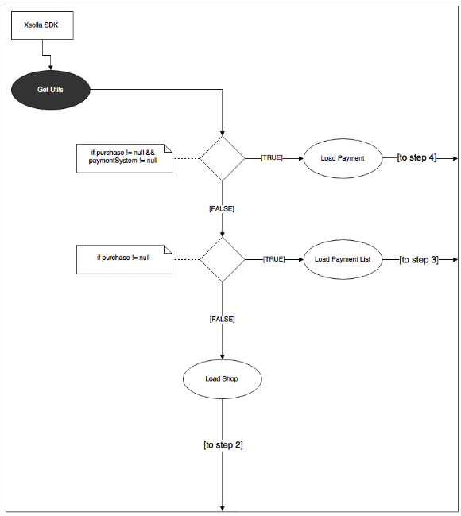

Описание библиотеки, реализующей функции магазина на основе [Pay Station API](https://developers.xsolla.com/api/v2/pay-station/).

 * [1. Общие сведения](#1-общие-сведения)
 * [2. Термины и определения](#2-термины-и-определения)
 * [3. Эксплуатационное назначение](#3-эксплуатационное-назначение)
 * [4. Функциональное назначение](#4-функциональное-назначение)
   * [4.1. Серверная интеграция](#41-серверная-интеграция)
   * [4.2. Упрощенная интеграция](#42-упрощенная-интеграция)
 * [5. Общая схема работы](#5-общая-схема-работы)
   * [5.1. Инициализирующий запрос](#51-инициализирующий-запрос)
   * [5.2. Выбор покупки](#52-выбор-покупки)
   * [5.3. Выбор платежной системы](#53-выбор-платежной-системы)
     * [5.3.1. Покупка за реальную валюту](#531-покупка-за-реальную-валюту)
     * [5.3.2. Покупка за виртуальную валюту](#532-покупка-за-виртуальную-валюту)


# 1. Общие сведения

Библиотека должна облегчать использование платежного решения Xsolla разработчиками альтернативных платформ и снижать порог входа при использовании продукта на конкретной платформе.

# 2. Термины и определения

* **Токен** - специальная шифрованная строка, необходимая для взаимодействия с Xsolla.
* **Header** - верхняя часть окна магазина. Включает в себя всё до пунктов навигационного меню включительно.
* **Footer** - нижняя часть окна магазина.
* **Серверная интеграция** - интеграция и взаимодействие с Xsolla происходит посредством специально настроенного сервера.
* **Упрощённая интеграция** - сервер игры отсутствует, все взаимодействия осуществляются через клиент.

# 3. Эксплуатационное назначение

Цель создания библиотеки:

* предоставить инструмент для разработчиков, который снизит трудозатраты по внедрению платежного решения компании Xsolla; 
* улучшить user experience конечного пользователя: инструмент должен быть нативным, требовать меньше (или исключать) дополнительных переходов на сторонние окна.

# 4. Функциональное назначение

В общем виде должна быть создана библиотека, при использовании которой у разработчика не возникнет вопросов о ее назначении. Разработчику должно быть достаточно использовать одну функцию, чтобы получить полный набор функций электронного магазина с модулями виртуальной валюты, виртуальных товаров, подписок и поддержкой платежных методов. 

Посредством взаимодействия с [Pay Station API](https://developers.xsolla.com/api/v2/pay-station/) должна быть реализована отрисовка магазина со всеми внутренними взаимодействиями, включающая в себя следующие экраны:  

* экран виртуальных товаров; 
* экран виртуальной валюты; 
* экран подписок;
* экран выбора платежных методов; 
* экран оплаты; 
* экран статуса; 
* экран ошибки.

Необходимо реализовать два варианта взаимодействия c [Pay Station API](https://developers.xsolla.com/api/v2/pay-station/) в формате POST или GET запросов:

* **[Серверная интеграция](#41-серверная-интеграция)** - передается строка токена. 
* **[Упрощённая интеграция](#42-упрощенная-интеграция)** - передается  JSON.

## 4.1. Серверная интеграция

>Необходимо доработать раздел.

## 4.2. Упрощенная интеграция

Подготовить специальный параметризированный объект, чтобы у разработчика не возникла необходимость самостоятельно генерировать его. 
Реализовать возможность взаимодействия с [Pay Station API](https://developers.xsolla.com/api/v2/pay-station/) в сандбокс-режиме. В URL перед `secure` добавлять префикс `sandbox-`. Соответственно, разработчик должен иметь возможность определить, в каком режиме проводятся платежи.

Пример передаваемого JSON:

```JSON
{
    "user":{
        "id":{
            "value":0
        },
        "name":"",
        "email":"",
        "country":{
            "value":"",
            "allow_modify":false
        }
    },
    "settings":{
        "project_id":0,
        "language":"",
        "currency":"",
        "mode":"sandbox",
        "secretKey":""
    }
}
```
Ожидаемый результат -  функция либо объект с параметрами: 

```JSON
CreateShop(
            string, // token или json
            bool, // isSandbox
            OkCallback, // возможность обработать успешный платёж
            ErrorCallbck // возможность обработать платёж с ошибкой
);
```

`OkCallback`, `ErrorCallbck`  могут быть реализованы любым удобным способом и не  обязательно должны передаваться как параметры.
После вызова данной функции управление процессом работы приложения со стороны разработчика заканчивается и переходит под управление библиотеки. Контроль над работой приложения разработчик получает вновь лишь в момент успешного или неуспешного завершения платежа. 
Порядок запросов и переходов описан в разделе [Общая схема работы](#5-общая-схема-работы). 

# 5. Общая схема работы
Общая схема взаимодействия ([Рисунок 1](#рисунок-1)) с [Pay Station API](https://developers.xsolla.com/api/v2/pay-station/) включает в себя 5 основных шагов:

1. Инициализирующий запрос. 
2. Выбор покупки.
3. Выбор платёжной системы.
4. Совершение покупки. 
5. Статус покупки.

<a name="рисунок-1"></a>


Рисунок 1. Общая схема работы с Pay Station API

Шаги 2 и 3 необязательные и могут быть пропущены. Вся информация, необходимая для определения схемы, может быть получена из инициализирующего запроса. 

## 5.1. Инициализирующий запрос

Схема запроса представлена на [Рисунке 2](#рисунок-2). Инициализирующим запросом в данном случае является запрос Utils. Ответ запроса содержит информацию для работы сервиса.
Далее осуществляется переход на:

* шаг 2, если в ответе не содержится покупка (`purchase`);
* шаг 3, если в ответе содержится покупка и товар (`virtual_currency`, `virtual_items` или `subscription`), но нет платежной системы (`payment_system`);
* шаг 4, если в ответе содержится покупка, товар и платежная система (`payment_system`).
    На данном этапе имеются все необходимые данные для header и footer окна магазина и начинается построение интерфейса.

<a name="рисунок-2"></a>


Рисунок 2. Инициализирующий запрос

## 5.2. Выбор покупки

Переход на данный шаг осуществляется, если на предыдущем не был получен товар (`virtual_currency`, `virtual_items` или `subscription`). На этом шаге происходит построение магазина, в котором пользователь сможет выбрать понравившийся товар и совершить покупку (Рисунок [3](#рисунок-3), [4](#рисунок-4)).

Используется информация из  [инициализирующего запроса](#51-инициализирующий-запрос), поля из объекта настроек (`settings`): `goods_at_first`, `pricepoints_at_first`, `subscriptions_at_first`, которые могут принимать значения 0 или 1. В зависимости от полученных значений отображаются пункты меню **Товары**, **Виртуальная валюта** и **Подписки** соответственно. Загружается одна из категорий и отображается для пользователя. Та же логика работает и при переключении пунктов меню. 

<a name="рисунок-3"></a>


Рисунок 3. Магазин - построение меню

Далее осуществляется выбор товаров.

<a name="рисунок-4"></a>


Рисунок 4. Магазин - выбор товаров

## 5.3. Выбор платежной системы

После выбора товара происходит переход к выбору платежной системы. Возможны два варианта:

* покупка за реальную валюту;
* покупка за виртуальную валюту.

### 5.3.1. Покупка за реальную валюту

В данном случае осуществляется переход к проверке пользовательского баланса.  Если средств на балансе достаточно, то оплата производится через Xsolla Balance.  В противном случае открывается список платежных систем ([Рисунок 5](#рисунок-5)).

<a name="рисунок-5"></a>


Рисунок 5. Переход к выбору платежной системы

### 5.3.2 Покупка за виртуальную валюту
При покупке за виртуальную валюту порядок действий следующий:

1. Сначала выполняется запрос `Summary` (см. [Рисунок 5](#рисунок-5)). Ответ состоит из содержимого покупки и метки, которая сообщает, нужно ли подтверждение пользователя. Если не нужно, перейти к следующему шагу, если нужно - перейти к шагу 3 данной инструкции.
2. Выполняется запрос `Proceed`, который возвращает ошибку либо `null`. Если вернулась ошибка, перейти к следующему шагу, если `null` - перейти к шагу 4 данной инструкции.
3. Пользователю показывается экран подтверждения платежа с его покупкой и чекбокс с вопросом “Спрашивать ли подтверждение в следующий раз?”. А также ошибка, если переход осуществлен после запроса `Proceed`.
4. Осуществляется платеж через Xsolla Balance.
